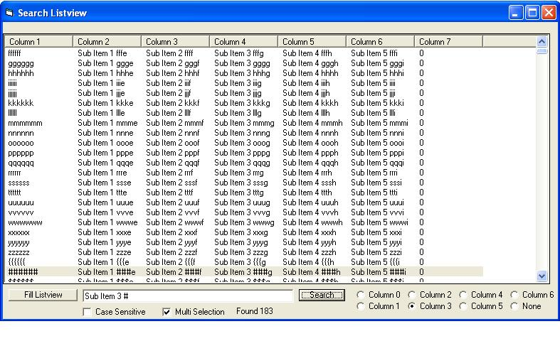



## Search Listview in any mode

### Description

Search a Listview in any mode (icon, list, report)

searches a listview even the sub items are included

Includes multiple selections (selects all matches throughout the listview)

Case sensitive searches possible

Restrict the search to a single column or search all columns(subitems)

Fast enough to search through 20000 items as you type

Upon initialization the items and subitems are appended to the tag property of each main item greatly speeding up the search.

SearchListVw(Listview,Searchtext,Start,CaseSens,MultiSelect,RestrictedColumn)

*Limitations*

no whole word only searching

no search direction (only top to bottom)
 
### More Info
 

             |
---                |---
**Submitted On**   |2010-06-10 03:37:54
**By**             |[William W](https://github.com/Planet-Source-Code/PSCIndex/blob/master/ByAuthor/william-w.md)
**Level**          |Beginner
**User Rating**    |5.0 (10 globes from 2 users)
**Compatibility**  |VB 6\.0
**Category**       |[VB function enhancement](https://github.com/Planet-Source-Code/PSCIndex/blob/master/ByCategory/vb-function-enhancement__1-25.md)
**World**          |[Visual Basic](https://github.com/Planet-Source-Code/PSCIndex/blob/master/ByWorld/visual-basic.md)
**Archive File**   |[Search\_Lis2182646102010\.zip](https://github.com/Planet-Source-Code/william-w-search-listview-in-any-mode__1-73204/archive/master.zip)

